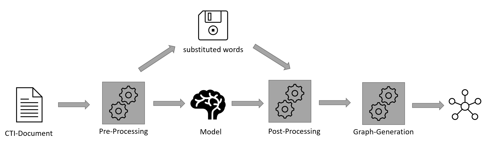

# Relation-Extraction-and-Knowledge-Graph-Generation-on-MISP-Event-Reports
## Master's thesis on extracting Relations from CTI Texts
## Work on Repo in Progress
## Abstract
The rapid growth of cyber-attacks requires organizations to be aware of procedures
currently employed by malicious actors. This awareness can be gained through the
sharing of cyber threat intelligence (CTI). As manually examining all CTI information
is a time-intensive task for security analysts, this work investigates the possibilities of
extracting relevant relations present within CTI-texts by using deep learning models
to generate knowledge graphs for easier understanding. Because no fitting dataset
for relation extraction in the CTI domain was publicly available, a dataset was created
as part of this work. Using this dataset as well as the New-York-Times relation
extraction dataset we fine-tuned Googles T5 language model to extract relations from
CTI-texts. This combination of model, data, and framing relation extraction as a
sequence-to-sequence task proved to be most effective for extracting relations from
CTI-texts. To improve the model’s performance on the highly nuanced texts present in
CTI reports, a pre-processing pipeline, which replaces special words before passing
them to the deep learning model, was developed. Results show that the use of the
pre-processing pipeline was highly effective, increasing the model’s performance by
27%. Using the system, sensible relations can be extracted from reports. However,
due to limitations in the dataset, the developed model cannot achieve human-level
performance at generating knowledge graphs from event reports. Contributions of this
work to the field of natural language processing in the CTI-domain include: a publicly
available dataset for training named entity recognition and relation extraction models,
a model which can extract relations from CTI-texts with an F1-Score of 0.38 and a
pre-processing pipeline that introduces the concept of using wordlists of important
CTI-terms such as names of malware or threat actors.

## System Overview

## Huggingface Models and Datasets
### Base dataset created with Alexander Schwankner 
- mrmoor/cyber-threat-intelligence
- mrmoor/cti-corpus-raw
### Adapted Dataset 
- Olec/cyber-threat-intelligence_v2
### Models with required preprocessing(pipe) and without 
- Olec/cyber_rebel_no_pipe
- Olec/cyber_rebel
## Repo Structure
